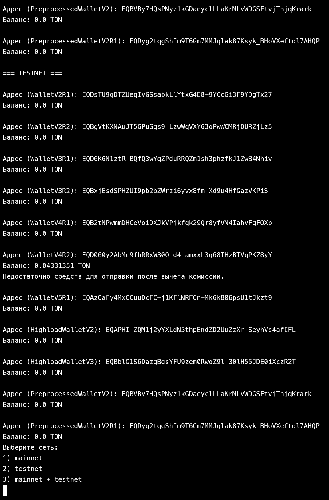

# all-ton-wallets

Checking all TON wallets

# Установка необходимых зависимостей

Для работы с данным проектом необходимо установить библиотеку `pytoniq-core`. Вы можете сделать это, выполнив следующую команду в терминале:
```pip install pytoniq-core```
# wallet versions (11)
WalletV2R1
WalletV2R2
WalletV3R1
WalletV3R2
WalletV4R1
WalletV4R2
WalletV5R1
HighloadWalletV2
HighloadWalletV3
PreprocessedWalletV2
PreprocessedWalletV2R1

mainnet, testnet

#code operation

select a menu item. enter a mnemonic phrase. There is no verification for the validity of the phrase. it can be either "test" or "abandon*23 about". After that, 11 versions of wallets are created in the testnet network and the mainnet network, if the balance is more than 0.05 TONS, then a transaction of all TONS is created to your addresses specified in the code. 0.05 transaction fee.

выберите пункт меню. введите мнемоническую фразу. Нет проверки на валидность фразы. она может быть как "test" так и "abandon*23 about ". после создаются 11 версий кошельков в testnet сети и mainnet сети, если на балансе более 0.05 TON то создаётся транзакция всех TON на ваши адреса указанные в коде. 0.05 комиссия за транзакцию.
